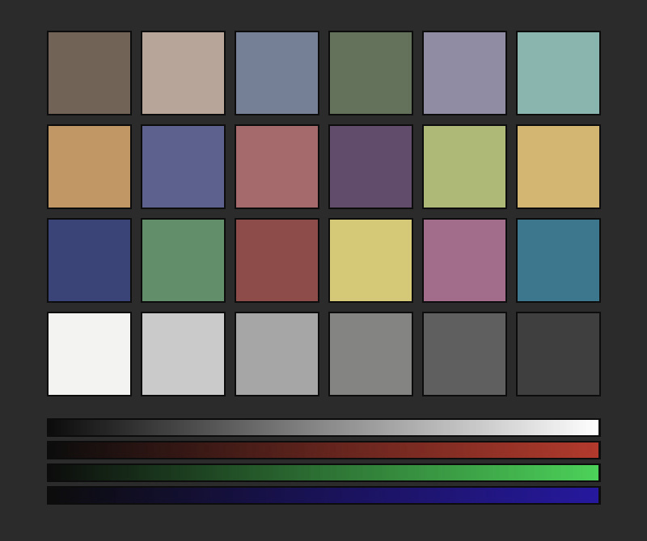
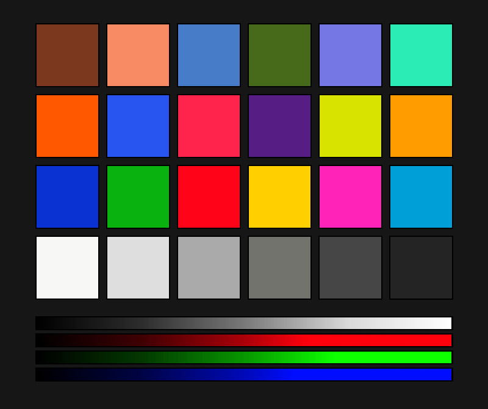
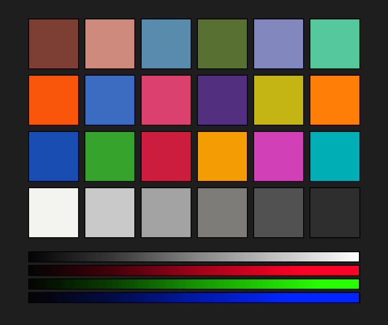
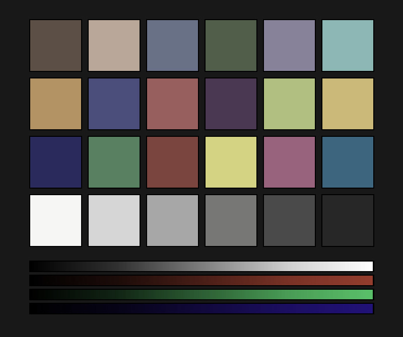
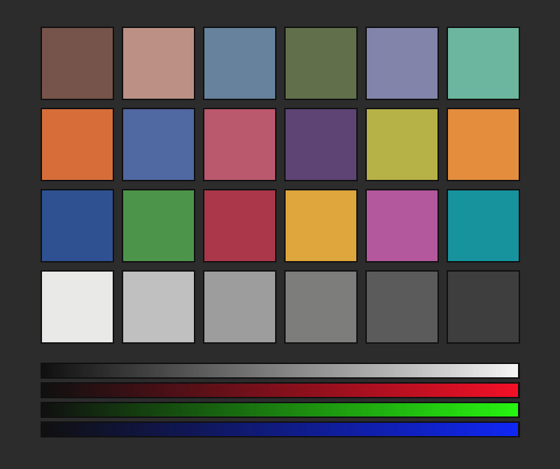
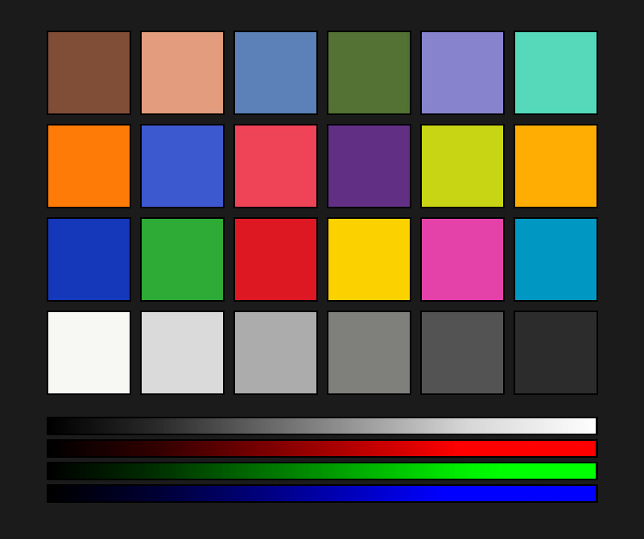
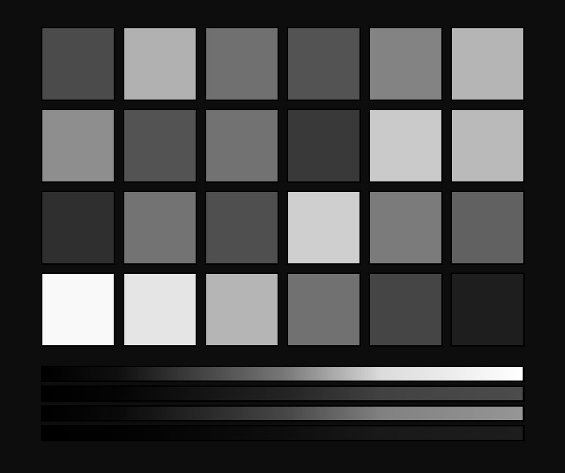
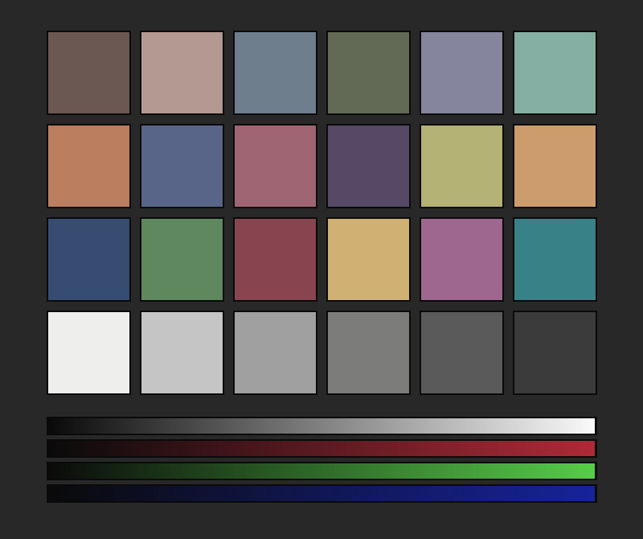

# 📸 Nikon Custom Picture Control (NCP) Film Recipe Collection

Kho lưu trữ các bộ lọc màu tùy chỉnh chuyên dụng dành cho máy ảnh Nikon (hỗ trợ cả các dòng Mirrorless Z-series và DSLR). Các bộ lọc màu được mô phỏng từ các cấu hình màu giả lập phim của **Honor** và nghệ thuật ánh sáng của **Studio Harcourt** (phát triển dựa trên các thuật toán xử lý màu sắc của Fujifilm, Kodak và Harcourt).

---

## 🎨 Danh sách 9 Bộ Lọc Màu Honor & Harcourt (Profile Directory)

Dưới đây là danh sách các cấu hình màu đã được thiết lập sẵn. Bạn có thể tải nhanh toàn bộ bộ lọc màu tại đây: [📥 Tải về toàn bộ (CUSTOMPC.zip)](CUSTOMPC.zip). Hoặc chọn tải riêng từng bộ lọc màu dưới bảng sau:

|                 Ảnh xem trước (Preview)                  | Tên bộ lọc              | Profile gốc  | Phong cách mô phỏng                                         |                 Tải về                 |
| :------------------------------------------------------: | :---------------------- | :----------- | :---------------------------------------------------------- | :------------------------------------: |
|      | **Clear Neg KP160**     | `PORTRAIT`   | Giả lập Kodak Portra 160: Tone da hồng hào, màu pastel dịu  |   [📥](CUSTOMPC/KP160_CLEAR_NEG.NCP)   |
|       | **Rich Neg KE100**      | `VIVID`      | Giả lập Kodak Ektar 100: Màu rực rỡ gắt gao cho phong cảnh  |   [📥](CUSTOMPC/KE100_RICH_NEG.NCP)    |
|       | **Warm Neg KG200**      | `STANDARD`   | Giả lập Kodak Gold 200: Tông vàng ấm áp cổ điển             |   [📥](CUSTOMPC/KG200_WARM_NEG.NCP)    |
|    | **Classic Neg NC100**   | `NEUTRAL`    | Giả lập Fujifilm Classic Negative (Superia): Shadows sâu    |  [📥](CUSTOMPC/NC100_CLASSIC_NEG.NCP)  |
|    | **Classic Pos CC200**   | `NEUTRAL`    | Giả lập Fujifilm Classic Positive: Màu lặng sâu lắng        |  [📥](CUSTOMPC/CC200_CLASSIC_POS.NCP)  |
|  | **Nostalgic Neg NN400** | `NEUTRAL`    | Giả lập Fujifilm Nostalgic Neg: Tone hổ phách vàng ấm       | [📥](CUSTOMPC/NN400_NOSTALGIC_NEG.NCP) |
|     | **Harcourt Vibrant**    | `PORTRAIT`   | Harcourt Vibrant: Ánh sáng rực rỡ, chân dung phát sáng      |  [📥](CUSTOMPC/HARCOURT_VIBRANT.NCP)   |
|     | **Harcourt Classic**    | `MONOCHROME` | Harcourt Classic: Trắng đen spotlight tương phản nghệ thuật |  [📥](CUSTOMPC/HARCOURT_CLASSIC.NCP)   |
|      | **Harcourt Colour**     | `PORTRAIT`   | Harcourt Colour: Tone màu ấm áp, saturation giảm mịn màng   |   [📥](CUSTOMPC/HARCOURT_COLOUR.NCP)   |

---

## 💾 Hướng dẫn cài đặt lên máy ảnh Nikon

Để sử dụng bộ lọc màu trực tiếp khi chụp (áp dụng cho cả ảnh JPEG ăn liền và lưu trong file RAW), hãy làm theo các bước sau:

### Bước 1: Chuẩn bị thẻ nhớ SD

1. Cắm thẻ nhớ SD của máy ảnh vào máy tính.
2. Tại thư mục gốc của thẻ nhớ, tạo một thư mục tên là **`NIKON`** (chữ in hoa).
3. Bên trong thư mục `NIKON`, tiếp tục tạo một thư mục con tên là **`CUSTOMPC`** (chữ in hoa).

> Cấu trúc thư mục đúng sẽ là:
>
> ```text
> 📁 [Thẻ nhớ SD] (Thư mục gốc)
>  └── 📁 NIKON
>       └── 📁 CUSTOMPC
>            └── 📄 [Copy các tệp *.NCP vào đây]
> ```

### Bước 2: Sao chép tệp cấu hình màu

Tải các tệp cấu hình `.NCP` mong muốn từ bảng danh sách phía trên, hoặc tải toàn bộ từ tệp [CUSTOMPC.zip](CUSTOMPC.zip) rồi giải nén, sau đó sao chép chúng vào thư mục **`CUSTOMPC`** vừa tạo trên thẻ nhớ.

### Bước 3: Nạp vào máy ảnh Nikon

1. Lắp thẻ nhớ SD vào máy ảnh Nikon của bạn và bật máy lên.
2. Bấm nút **Menu**, tìm đến menu chụp ảnh (Photo Shooting Menu).
3. Chọn mục **Manage Picture Control** (Quản lý Picture Control).
4. Chọn **Load/Save** (Nạp/Ghi đè) -> chọn tiếp **Copy to Camera** (Sao chép vào máy ảnh).
5. Chọn bộ lọc màu bạn muốn lưu và gán vào một trong các ô nhớ trống từ **`C-1`** đến **`C-9`** trên máy ảnh.
6. Đặt tên hiển thị tùy ý hoặc giữ nguyên và lưu lại. Giờ đây bạn đã có thể chọn bộ lọc màu này trong danh sách Picture Control khi chụp ảnh!

---

## 💻 Hướng dẫn sử dụng trên máy tính với NX Studio

Nếu bạn chụp ảnh RAW (`.NEF`), bạn có thể áp dụng các bộ lọc này trong quá trình hậu kỳ:

1. Mở phần mềm **NX Studio** của Nikon trên máy tính.
2. Ở bảng chỉnh sửa bên phải, tìm thẻ **Picture Control**.
3. Chọn danh sách thả xuống và bấm vào **Import Custom Picture Control file...**.
4. Trỏ tới tệp `.NCP` bạn đã tải về để nạp vào phần mềm và áp dụng lên các ảnh RAW.

---

## 🛠️ Công cụ phát triển (For Developers)

Repository này tích hợp sẵn bộ mã nguồn bằng ngôn ngữ Dart để tự động tính toán bảng màu LUT 256 phần tử tuyến tính (Linear Interpolation) và xuất ra file nhị phân `.NCP` chuẩn xác:

- **Môi trường yêu cầu**: Đã cài đặt [Dart SDK](https://dart.dev/get-dart).
- **Cài đặt thư viện**:
  ```bash
  dart pub get
  ```
- **Sinh lại toàn bộ bộ lọc, ảnh xem trước và file zip**:
  ```bash
  dart run bin/generate_filters.dart
  ```
- **Kiểm tra thông số cấu trúc tệp `.NCP` bất kỳ**:
  ```bash
  dart run bin/view_ncp.dart <đường_dẫn_file_NCP>
  ```
