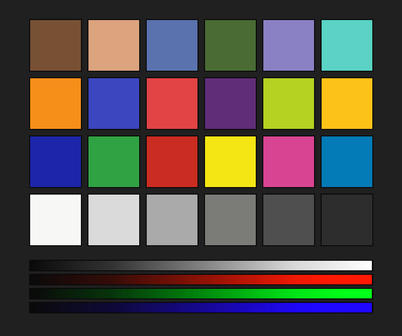

# Nikon Custom Picture Control: Cine Look

Bộ lọc màu thiết lập chuyên dụng cho máy ảnh Nikon (được nạp trực tiếp vào máy ảnh hoặc qua phần mềm NX Studio).

## 🖼️ Ảnh mô phỏng bộ lọc màu (ColorChecker Preview)
Bảng màu tiêu chuẩn ColorChecker so sánh giữa ảnh gốc và ảnh sau khi áp dụng bộ lọc màu:

| Ảnh gốc (Original) | Đã áp dụng bộ lọc (Filtered) |
| :---: | :---: |
|  |  |

## 📊 Thông tin tệp tin
- **Tên tệp**: `CINE_LOOK.NCP`
- **Kích thước**: `638 bytes`
- **Chữ ký**: `NCP\x00` (Hợp lệ)

## ⚙️ Các thông số Slider
| Tham số | Thiết lập | Mô tả |
| --- | --- | --- |
| **Profile gốc** | `STANDARD (Tieu chuan)` | Cấu hình màu nền |
| **Sharpening (Độ nét)** | `+3` | Độ sắc nét chi tiết |
| **Contrast (Tương phản)** | `Custom Curve (Duong cong tuy chinh)` | Độ tương phản sắc độ |
| **Brightness (Độ sáng)** | `Custom Curve (Duong cong tuy chinh)` | Sắc độ sáng |
| **Saturation (Độ rực màu)** | `+1` | Độ bão hòa màu sắc |
| **Hue (Tông màu)** | `+2` | Độ lệch dải tông màu |

## 📈 Đường cong tùy chọn (Custom Tone Curve)
- **Điểm đen đầu vào (Black Point)**: `0`
- **Điểm trắng đầu vào (White Point)**: `255`
- **Ngõ ra tối thiểu (Out Min)**: `0`
- **Ngõ ra tối đa (Out Max)**: `255`
- **Điểm trung tính Halftone**: `1.00`
- **Số điểm mốc vẽ**: `5`

| Mốc | Đầu vào | Đầu ra |
| --- | --- | --- |
| Mốc 0 | 0 | 10 |
| Mốc 1 | 60 | 50 |
| Mốc 2 | 128 | 130 |
| Mốc 3 | 195 | 215 |
| Mốc 4 | 255 | 255 |

## 📉 Đồ thị ánh xạ độ sáng (LUT - 256 Entries)
Đồ thị thu gọn minh họa mức độ ánh xạ độ sáng (0 -> 32767):
```text
Input   0 => Output  1381 |#.............................|
Input  17 => Output  2833 |##............................|
Input  34 => Output  4285 |###...........................|
Input  51 => Output  5737 |#####.........................|
Input  68 => Output  7711 |#######.......................|
Input  85 => Output 10273 |#########.....................|
Input 102 => Output 12835 |###########...................|
Input 119 => Output 15397 |##############................|
Input 136 => Output 18054 |################..............|
Input 153 => Output 20817 |###################...........|
Input 170 => Output 23580 |#####################.........|
Input 187 => Output 26343 |########################......|
Input 204 => Output 28411 |##########################....|
Input 221 => Output 29863 |###########################...|
Input 238 => Output 31315 |############################..|
Input 255 => Output 32767 |##############################|
```
