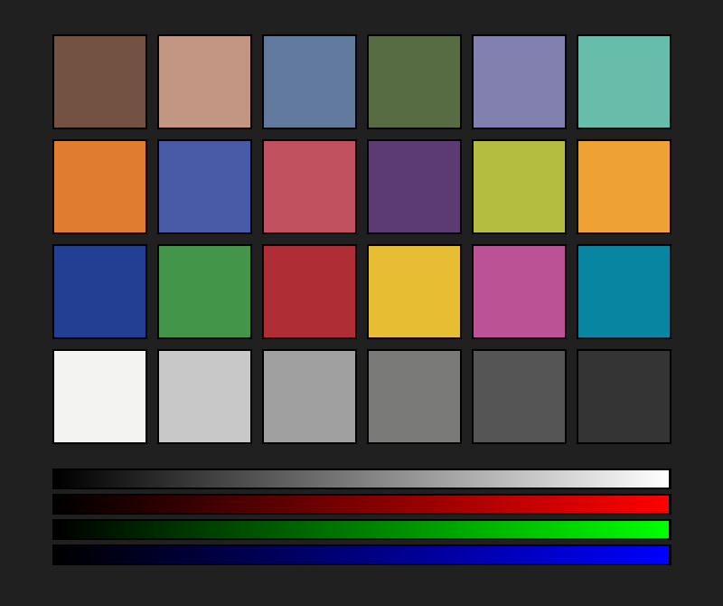
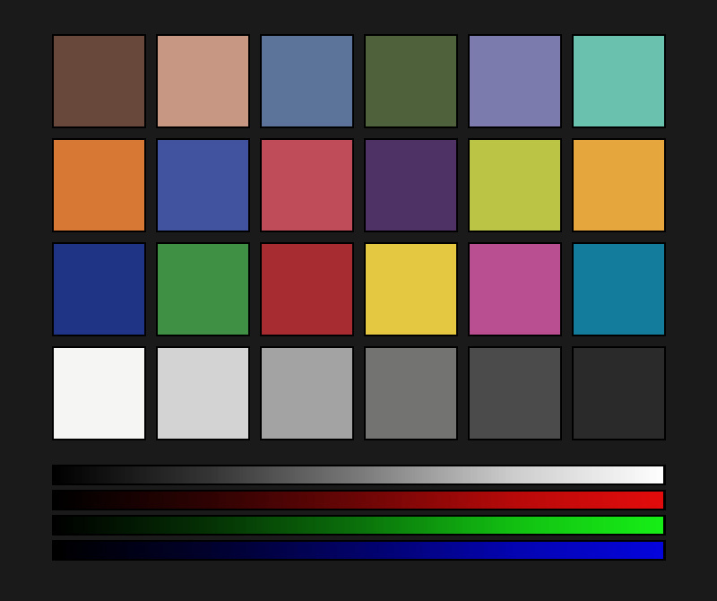

# Nikon Custom Picture Control: Classic Chrome

Bộ lọc màu thiết lập chuyên dụng cho máy ảnh Nikon (được nạp trực tiếp vào máy ảnh hoặc qua phần mềm NX Studio).

## 🖼️ Ảnh mô phỏng bộ lọc màu (ColorChecker Preview)
Bảng màu tiêu chuẩn ColorChecker so sánh giữa ảnh gốc và ảnh sau khi áp dụng bộ lọc màu:

| Ảnh gốc (Original) | Đã áp dụng bộ lọc (Filtered) |
| :---: | :---: |
|  |  |

## 📊 Thông tin tệp tin
- **Tên tệp**: `CLASSIC_CHROME.NCP`
- **Kích thước**: `638 bytes`
- **Chữ ký**: `NCP\x00` (Hợp lệ)

## ⚙️ Các thông số Slider
| Tham số | Thiết lập | Mô tả |
| --- | --- | --- |
| **Profile gốc** | `NEUTRAL (Trung tinh)` | Cấu hình màu nền |
| **Sharpening (Độ nét)** | `+2` | Độ sắc nét chi tiết |
| **Contrast (Tương phản)** | `Custom Curve (Duong cong tuy chinh)` | Độ tương phản sắc độ |
| **Brightness (Độ sáng)** | `Custom Curve (Duong cong tuy chinh)` | Sắc độ sáng |
| **Saturation (Độ rực màu)** | `-1` | Độ bão hòa màu sắc |
| **Hue (Tông màu)** | `+0` | Độ lệch dải tông màu |

## 📈 Đường cong tùy chọn (Custom Tone Curve)
- **Điểm đen đầu vào (Black Point)**: `0`
- **Điểm trắng đầu vào (White Point)**: `255`
- **Ngõ ra tối thiểu (Out Min)**: `0`
- **Ngõ ra tối đa (Out Max)**: `255`
- **Điểm trung tính Halftone**: `1.00`
- **Số điểm mốc vẽ**: `5`

| Mốc | Đầu vào | Đầu ra |
| --- | --- | --- |
| Mốc 0 | 0 | 0 |
| Mốc 1 | 64 | 52 |
| Mốc 2 | 128 | 122 |
| Mốc 3 | 192 | 205 |
| Mốc 4 | 255 | 255 |

## 📉 Đồ thị ánh xạ độ sáng (LUT - 256 Entries)
Đồ thị thu gọn minh họa mức độ ánh xạ độ sáng (0 -> 32767):
```text
Input   0 => Output   110 |..............................|
Input  17 => Output  1879 |#.............................|
Input  34 => Output  3648 |###...........................|
Input  51 => Output  5417 |####..........................|
Input  68 => Output  7330 |######........................|
Input  85 => Output  9711 |########......................|
Input 102 => Output 12092 |###########...................|
Input 119 => Output 14473 |#############.................|
Input 136 => Output 17063 |###############...............|
Input 153 => Output 19886 |##################............|
Input 170 => Output 22710 |####################..........|
Input 187 => Output 25533 |#######################.......|
Input 204 => Output 27583 |#########################.....|
Input 221 => Output 29311 |##########################....|
Input 238 => Output 31039 |############################..|
Input 255 => Output 32767 |##############################|
```
